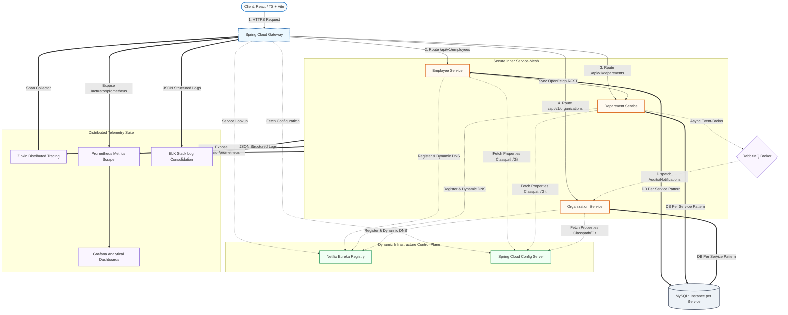
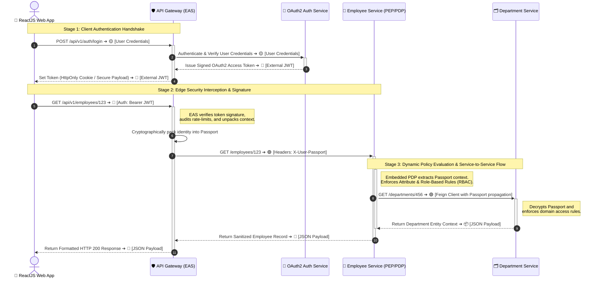
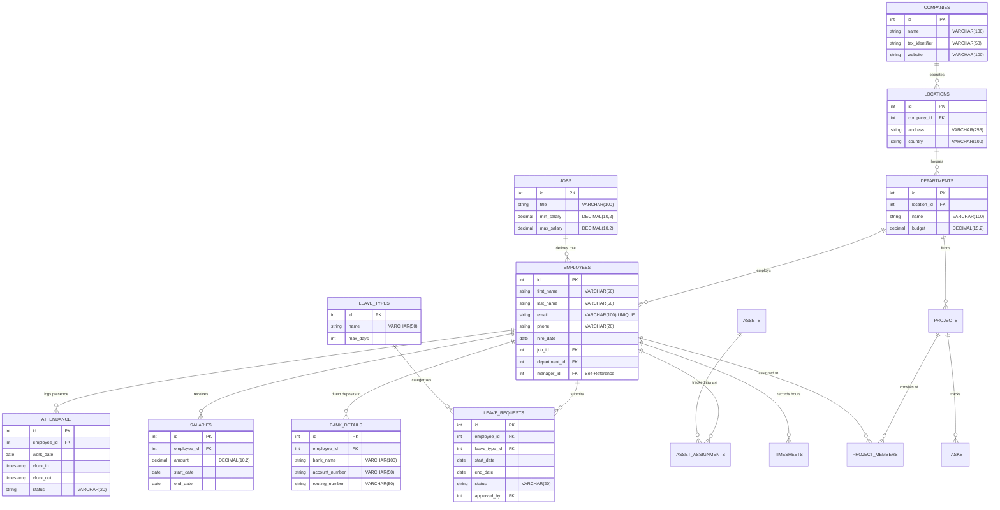

# 🏢 Enterprise Employee Management Microservices (EMS)

<div align="center">

[](https://spring.io/projects/spring-boot)
[](https://spring.io/projects/spring-cloud)
[](https://www.oracle.com/java/technologies/downloads/)
[](https://react.dev/)
[](https://www.docker.com/)
[](https://kubernetes.io/)

<p align="center">
  A state-of-the-art, enterprise-grade cloud-native Employee Management System (EMS) designed on a highly scalable, secure, and resilient microservices architecture utilizing Spring Boot 3.x, Spring Cloud, ReactJS, RabbitMQ, and MySQL.
</p>

[✨ Core Features](#-core-features) • [🏗️ System Architecture](#%EF%B8%8F-system-architecture) • [🔒 Security & Authentication](#-security--authentication-architecture) • [🚀 Quick Start](#-getting-started) • [📊 Database Schema](#-database-schema) • [📈 Observability](#-observability--observability-suite)

</div>

***

## 📖 Table of Contents

- [✨ Core Features](#-core-features)
- [🏗️ System Architecture](#%EF%B8%8F-system-architecture)
  - [High-Level Design (HLD)](#high-level-design-hld)
  - [Low-Level Design (LLD) / Security Flow](#low-level-design-lld--security-flow)
- [🔒 Security & Authentication Architecture](#-security--authentication-architecture)
  - [1. Edge-Level Gateway Authentication](#1-edge-level-gateway-authentication)
  - [2. Signed internal "Passport" Identity Propagation](#2-signed-internal-passport-identity-propagation)
  - [3. Service-Level Authorization (Embedded PDP)](#3-service-level-authorization-embedded-pdp)
  - [4. Service-to-Service mTLS & Network Segmentation](#4-service-to-service-mtls--network-segmentation)
- [📦 Microservice Ecosystem Components](#-microservice-ecosystem-components)
- [🔌 REST API Reference & Payload Samples](#-rest-api-reference--payload-samples)
- [📊 Database Schema](#-database-schema)
  - [Entity-Relationship Diagram (ERD)](#entity-relationship-diagram-erd)
  - [Key Operational Normalization Modules](#key-operational-modules-and-auditability)
- [📈 Observability & Resilience Suite](#-observability--resilience-suite)
  - [Observability Dashboard Matrix](#observability-dashboard-matrix)
  - [Distributed Tracing and Core Resilience Patterns](#distributed-tracing-and-core-resilience-patterns)
- [🚀 Getting Started](#-getting-started)
  - [Prerequisites](#prerequisites)
  - [Local Orchestration with Docker Compose](#local-orchestration-with-docker-compose)
  - [Configuration Profiles](#configuration-profiles)
- [🧪 Unified Testing Protocol](#-unified-testing-protocol)
- [🚢 CI/CD & Cloud Deployment](#-cicd--cloud-deployment)
- [📄 Versioning & Release History](#-versioning--release-history)

***

## ✨ Core Features

*   **Microservices Architecture**: Completely decoupled domain bounds with dedicated databases per service, eliminating single points of failure [116, 192].
*   **Edge Routing & API Gateway**: Centralized request interception, cross-cutting concern handling, routing, dynamic rate limiting, and edge security enforcement [117, 220].
*   **Distributed Configuration**: Externalized configuration registry with native/Git file tracking, enabling instant runtime properties refresh without system redeployment [117, 205].
*   **Service Registration & Dynamic Discovery**: Automatic service registry and routing resolution using Eureka, enabling elastic scaling [117, 206].
*   **Robust Fault Tolerance & Circuit Breakers**: Built-in self-healing layers preventing cascading crashes across service paths using active resilience wrappers [117, 199].
*   **Asynchronous Event-Driven Messaging**: Decoupled long-running business flows (e.g. payroll reporting, auditing, alerts) via RabbitMQ [117, 199].
*   **Observability & Telemetry Stack**: High-definition logging, distributed request tracing correlation, and central metrics rendering [117, 196].
*   **Secure Stateless RBAC**: Multi-tier authentication using JSON Web Tokens (JWT) protecting core payroll, employee records, and leaves [81, 103].
*   **Reactive Single-Page Web Frontend**: Beautiful modern dashboard built using ReactJS, TypeScript, and Vite [117, 118].

***

## 🏗️ System Architecture

The architecture implements a **three-tier layered model** (Presentation, Business Logic, and Data Storage Layers) distributed as self-contained microservices to optimize horizontal scaling, security containment, and fault isolation [100, 101, 162].

### High-Level Design (HLD)

The following diagram illustrates the routing and communication topology of client requests flowing through the secure gateway into the inner-service meshes:



### Low-Level Design (LLD) / Security Flow

This sequence trace diagram outlines the cryptographic handshakes, stateless edge token checking, and downstream **signed context propagation** across the microservices mesh:



***

## 🔒 Security & Authentication Architecture

The application adopts a **Defense in Depth** model [41, 252]. Security is implemented across four highly robust, modular layers:

```
[Client App] ---> [Layer 1: Gateway Proxy / EAS] ---> [Layer 2: Signed Passport Verification] ---> [Layer 3: Local Embedded PDP] ---> [Layer 4: service-to-service mTLS]
```

### 1. Edge-Level Gateway Authentication
The API Gateway acts as the **Edge Authentication Service (EAS)** [32, 220]. It intercepts all external client requests [117]. External JSON Web Tokens (JWT) are validated here, preventing direct anonymous access to the downstream services [11, 220]. This shields internal services from brute force, session hijacking, or gateway bypass vulnerabilities [9, 220].

### 2. Signed internal "Passport" Identity Propagation
Instead of propagating raw external JWTs downstream (which increases the attack surface and couples services to external providers) [28, 239], the API Gateway generates a secure, lightweight internal context called a **"Passport"** [32, 243]. This Passport is symmetrically signed using a secret retrieved from a Key Management System [32, 243], containing employee attributes, manager scopes, and roles [32, 243]. Downstream services verify the Passport using shared wrappers [33, 244].

### 3. Service-Level Authorization (Embedded PDP)
Following standard architectural security patterns, each microservice implements a centralized policy structure using an **Embedded Policy Decision Point (PDP)** [12, 222]. This approach prevents hardcoding permissions into business logic [38, 249]. 
*   **Security Configuration Setup**:
    ```java
    @Configuration
    @EnableWebSecurity
    @EnableMethodSecurity
    public class SecurityConfig {
        @Bean
        public SecurityFilterChain filterChain(HttpSecurity http) throws Exception {
            http.csrf(csrf -> http.disable())
                .sessionManagement(session -> session.sessionCreationPolicy(SessionCreationPolicy.STATELESS))
                .authorizeHttpRequests(auth -> auth
                    .requestMatchers("/api/v1/admin/**").hasRole("ADMIN")
                    .requestMatchers("/api/v1/employees/**").hasAnyRole("EMPLOYEE", "ADMIN")
                    .anyRequest().authenticated()
                )
                .addFilterBefore(new PassportAuthenticationFilter(), UsernamePasswordAuthenticationFilter.class);
            return http.build();
        }
    }
    ```

### 4. Service-to-Service mTLS & Network Segmentation
To completely enforce the **Zero-Trust Network Principle**, service-to-service communication is encapsulated within a **Mutual TLS (mTLS)** layer using a self-hosted Private Key Infrastructure (PKI) managed at the platform level [34, 35, 245]. This ensures confidentiality, service authenticity, and prevents internal spoofing or eavesdropping [34, 245].

***

## 📦 Microservice Ecosystem Components

| Service Name | Technology Stack | Purpose / Domain Function | Default Port |
| :--- | :--- | :--- | :--- |
| **`gateway-service`** | Spring Boot, Spring Cloud Gateway, WebFlux, JWT | Dynamic API Gateway routing, request auditing, rate-limiting, and OAuth2/JWT verification [117, 156]. | `8060` |
| **`config-service`** | Spring Cloud Config Server, Git/Classpath Storage | Centralized, dynamic property distribution across all environment services [117, 156]. | `8012` |
| **`discovery-service`**| Netflix Eureka Server | dynamic Service registration and DNS discovery server [117, 156]. | `8761` |
| **`employee-service`** | Java 17, Spring Data JPA, Hibernate, MySQL, mTLS | Encapsulates CRUD operations for core Employee records and career lifecycle histories [117, 156]. | `8082` |
| **`department-service`**| Java 17, Spring Data JPA, MySQL, Feign Clients | Manages Department structures, dynamic budgets, and mapping nodes [117, 156]. | `8083` |
| **`organization-service`**| Java 17, JPA, MySQL, RabbitMQ Listener | Consolidated reporting aggregator. Triggers asynchronous analytics processing [117, 156]. | `8084` |
| **`frontend-app`** | ReactJS, TypeScript, Vite, Nginx Proxy | Presentation layer for employees and administrators [117, 118]. | `3000` |

***


## 🔌 REST API Reference & Payload Samples

The EMS ecosystem exposes standardized RESTful endpoints secured via stateless JWT bearer tokens and validated internally using signed Passport contexts [81, 103, 243]. All JSON request and response models conform to standard RFC formats and align with the database schemas [126].

### 🔐 1. Authentication Service & API Gateway (`gateway-service` : `8060`)

Handles public client logins, generates stateful OAuth2 JWTs, and enforces edge rate-limiting and route mapping [117, 220].

#### 🔹 User Login and JWT Negotiation
* **Endpoint:** <span style="background-color:#007bff; color:white; padding:2px 6px; border-radius:4px; font-weight:bold; font-size:11px;">POST</span> `/api/v1/auth/login`
* **Access Level:** Public / Unauthenticated
* **Request Headers:**
  ```http
  Content-Type: application/json
  ```
* **Request Payload:**
  ```json
  {
    "username": "admin",
    "password": "SecurePassword123!"
  }
  ```
* **Response Payload (`200 OK`):**
  ```json
  {
    "token": "eyJhbGciOiJIUzI1NiIsInR5cCI6IkpXVCJ9.eyJzdWIiOiJhZG1pbiIsImlhdCI6MTc4OTA5ODQwMCwiZXhwIjoxNzg5MTAyMDAwfQ.abc123xyz...",
    "type": "Bearer",
    "expiresIn": 3600,
    "username": "admin",
    "roles": [
      "ROLE_ADMIN",
      "ROLE_HR"
    ],
    "issuedAt": "2026-09-05T02:35:00Z"
  }
  ```
* **Error Response (`401 Unauthorized`):**
  ```json
  {
    "type": "https://example.com/errors/unauthorized",
    "title": "Unauthorized Access",
    "status": 401,
    "detail": "Bad credentials. Please verify your username and password.",
    "instance": "/api/v1/auth/login",
    "timestamp": "2026-09-05T02:35:46Z",
    "errorId": "a3b4c5d6-e7f8-90a1-b2c3-d4e5f6a7b8c9"
  }
  ```

---

### 👥 2. Employee Microservice (`employee-service` : `8082`)

Manages the core employee personal data, job positions, salaries, and direct-deposit settings [117, 126].

#### 🔹 Fetch Employee by ID
* **Endpoint:** <span style="background-color:#28a745; color:white; padding:2px 6px; border-radius:4px; font-weight:bold; font-size:11px;">GET</span> `/api/v1/employees/{id}`
* **Access Level:** Authenticated (`ROLE_EMPLOYEE`, `ROLE_ADMIN`) [81, 103]
* **Request Headers:**
  ```http
  Authorization: Bearer eyJhbGciOi...
  Accept: application/json
  ```
* **Response Payload (`200 OK`):**
  ```json
  {
    "id": 123,
    "firstName": "John",
    "lastName": "Doe",
    "email": "john.doe@enterprise.com",
    "phone": "+1-555-0199",
    "hireDate": "2026-09-01",
    "jobId": 3,
    "departmentId": 8,
    "managerId": 1,
    "status": "ACTIVE"
  }
  ```
* **Error Response (`404 Not Found` - RFC 7807 [68, 178]):**
  ```json
  {
    "type": "https://example.com/problems/resource-not-found",
    "title": "Resource Not Found",
    "status": 404,
    "detail": "Employee with ID 999 was not found on this server.",
    "instance": "/api/v1/employees/999",
    "timestamp": "2026-09-05T02:35:46.123Z",
    "errorId": "f81d4fae-7dec-11d0-a765-00a0c91e6bf6"
  }
  ```

#### 🔹 Register New Employee Record
* **Endpoint:** <span style="background-color:#007bff; color:white; padding:2px 6px; border-radius:4px; font-weight:bold; font-size:11px;">POST</span> `/api/v1/employees`
* **Access Level:** Authenticated (`ROLE_ADMIN`, `ROLE_HR`) [81, 103]
* **Request Headers:**
  ```http
  Authorization: Bearer eyJhbGciOi...
  Content-Type: application/json
  ```
* **Request Payload:**
  ```json
  {
    "firstName": "Jane",
    "lastName": "Smith",
    "email": "jane.smith@enterprise.com",
    "phone": "+1-555-0144",
    "hireDate": "2026-09-05",
    "jobId": 2,
    "departmentId": 8,
    "managerId": 123
  }
  ```
* **Response Payload (`201 Created`):**
  ```json
  {
    "id": 124,
    "firstName": "Jane",
    "lastName": "Smith",
    "email": "jane.smith@enterprise.com",
    "phone": "+1-555-0144",
    "hireDate": "2026-09-05",
    "jobId": 2,
    "departmentId": 8,
    "managerId": 123,
    "status": "ACTIVE",
    "createdAt": "2026-09-05T02:36:00Z"
  }
  ```

#### 🔹 Update Employee Record
* **Endpoint:** <span style="background-color:#ffc107; color:black; padding:2px 6px; border-radius:4px; font-weight:bold; font-size:11px;">PUT</span> `/api/v1/employees/{id}`
* **Access Level:** Authenticated (`ROLE_ADMIN`, `ROLE_HR`) [81, 103]
* **Request Payload:**
  ```json
  {
    "firstName": "John",
    "lastName": "Doe",
    "email": "john.updated@enterprise.com",
    "phone": "+1-555-9999",
    "jobId": 3,
    "departmentId": 8,
    "managerId": 1
  }
  ```
* **Response Payload (`200 OK`):**
  ```json
  {
    "id": 123,
    "firstName": "John",
    "lastName": "Doe",
    "email": "john.updated@enterprise.com",
    "phone": "+1-555-9999",
    "hireDate": "2026-09-01",
    "jobId": 3,
    "departmentId": 8,
    "managerId": 1,
    "status": "ACTIVE"
  }
  ```

#### 🔹 Delete Employee Record
* **Endpoint:** <span style="background-color:#dc3545; color:white; padding:2px 6px; border-radius:4px; font-weight:bold; font-size:11px;">DELETE</span> `/api/v1/employees/{id}`
* **Access Level:** Authenticated (`ROLE_ADMIN`) [81, 103]
* **Response Payload (`200 OK`):**
  ```json
  {
    "message": "Employee record deleted successfully",
    "id": 123,
    "timestamp": "2026-09-05T02:37:00Z"
  }
  ```

---

### 🏢 3. Department Microservice (`department-service` : `8083`)

Manages corporate departments, physical location links, and allocated operational budgets [117, 126].

#### 🔹 Fetch Department Details
* **Endpoint:** <span style="background-color:#28a745; color:white; padding:2px 6px; border-radius:4px; font-weight:bold; font-size:11px;">GET</span> `/api/v1/departments/{id}`
* **Access Level:** Authenticated (`ROLE_EMPLOYEE`, `ROLE_ADMIN`) [81, 103]
* **Response Payload (`200 OK`):**
  ```json
  {
    "id": 8,
    "locationId": 2,
    "name": "Engineering",
    "budget": 1500000.00
  }
  ```

---

### 📈 4. Organization Microservice (`organization-service` : `8084`)

Aggregates data by orchestrating queries across `department-service` and `employee-service` using **Spring Cloud OpenFeign** client connections [117].

#### 🔹 Fetch Department Details with All Nested Employees
* **Endpoint:** <span style="background-color:#28a745; color:white; padding:2px 6px; border-radius:4px; font-weight:bold; font-size:11px;">GET</span> `/api/v1/organizations/departments/{id}/details`
* **Access Level:** Authenticated (`ROLE_ADMIN`, `ROLE_HR`) [81, 103]
* **Response Payload (`200 OK`):**
  ```json
  {
    "organizationId": 1,
    "companyName": "Enterprise Inc.",
    "department": {
      "id": 8,
      "name": "Engineering",
      "budget": 1500000.00
    },
    "employees": [
      {
        "id": 123,
        "firstName": "John",
        "lastName": "Doe",
        "email": "john.doe@enterprise.com",
        "phone": "+1-555-0199",
        "jobId": 3,
        "managerId": 1
      },
      {
        "id": 124,
        "firstName": "Jane",
        "lastName": "Smith",
        "email": "jane.smith@enterprise.com",
        "phone": "+1-555-0144",
        "jobId": 2,
        "managerId": 123
      }
    ],
    "aggregatedAt": "2026-09-05T02:38:00Z"
  }
  ```

---

### 🧪 5. Client Request Error Response Matrix (RFC 7807 Problem Details)

Standardized response block formats delivered by the `@RestControllerAdvice` global exception handler across all microservices [58, 60]:

| HTTP Status | Exception Class | Reason for Error | Sample Problem Detail Schema |
| :--- | :--- | :--- | :--- |
| **`400 Bad Request`** | `InvalidInputException` | Failed input validations (e.g. invalid email pattern or negative salaries) [104]. | `{"type": "https://example.com/errors/invalid-input", "title": "Invalid Input", "status": 400, "detail": "The email pattern is invalid.", "instance": "/api/v1/employees"}` |
| **`401 Unauthorized`** | `PassportAuthenticationException` | Request was intercepted at the inner service mesh with an invalid internal "Passport" [32, 243]. | `{"type": "https://example.com/errors/invalid-passport", "title": "Signature Verification Failed", "status": 401, "detail": "HMAC signature mismatch on downstream passport context."}` |
| **`403 Forbidden`** | `AccessDeniedException` | User possesses valid authentication but does not have the required RBAC roles (e.g. non-admin delete) [81]. | `{"type": "https://example.com/errors/forbidden", "title": "Access Denied", "status": 403, "detail": "Required authority [ROLE_ADMIN] is missing."}` |
| **`409 Conflict`** | `DataIntegrityViolationException`| Violating DB constraints, such as trying to reuse a unique email or register in an invalid department ID [129]. | `{"type": "https://example.com/errors/conflict", "title": "Data Conflict", "status": 409, "detail": "Email 'john.doe@enterprise.com' already exists."}` |
| **`503 Service Unavailable`** | `CallNotPermittedException` | The **Resilience4j Circuit Breaker** is in an `OPEN` state, blocking cascades and routing to fallbacks [70, 75, 209]. | `{"type": "https://example.com/errors/circuit-breaker-open", "title": "Circuit Breaker Active", "status": 503, "detail": "Downstream Department service is down. Running on degraded fallback configuration."}` |

***

## 📊 Database Schema

The EMS architecture leverages an enterprise-grade normalized relational schema consisting of modules mapped cleanly across bounded contexts to guarantee ACID compliance, low redundancy, and clear audit trials [91, 126].

### Entity-Relationship Diagram (ERD)

The core relational structure of the system database is detailed below:



### Key Operational Modules and Auditability

1.  **Organizational Topology Hierarchy**: Defined via `companies` ➔ `locations` ➔ `departments` [132]. The corporate structure enforces cascading validation rules [132], ensuring no employee is registered under non-existent departmental nodes [132].
2.  **Manager self-referencing hierarchy**: Mapped inside the `employees` table through the `manager_id` self-reference column [129, 132], facilitating dynamic, multi-tier approvals of leave requests and financial expenditures [132].
3.  **Financial Isolation**: compensation parameters (`salaries` and `bank_details`) are segmented cleanly into isolated database contexts [129], permitting granular encryption algorithms and access control scopes [136].
4.  **Career Audit and Mobility**: Automated historical transition captures are preserved in `department_history` and `job_history` logs to record transfers chronologically [131, 134].

***

## 📈 Observability & Resilience Suite

### Observability Dashboard Matrix

The microservices platform exposes complete system health metrics, tracing context, and unified log flows to manage operational complexity at scale [164]:

```
                                  [ Microservices Nodes ]
                                             |
        +------------------------------------+------------------------------------+
        | (Distributed Tracing Spans)        | (Metrics Scraping)                 | (JSON App Logs)
        v                                    v                                    v
  [ Zipkin Server ]                    [ Prometheus ]                     [ Logstash (ELK) ]
        |                                    |                                    |
        v (Trace Graph)                      v (PromQL Query)                     v (App Searches)
  [ Developer UI ]                     [ Grafana Dashboard ]                [ Kibana Logs console ]
```

### Distributed Tracing and Core Resilience Patterns

*   **Correlation & Trace Tracing**: Sleuth automatically injects a standard transaction Correlation ID (`trace-id` and `span-id`) into the request headers and logger instances [72, 196]. This correlation is dynamically propagated across any asynchronous Feign routing or messaging hops [72, 196].
*   **Centralized Log Aggregation**: App logs are formatted in structured JSON format and shipped directly to the central **Elasticsearch-Logstash-Kibana (ELK) stack** [71, 196].
*   **Advanced Fallbacks & Self-Healing**: Using **Resilience4j**, any call path failures are protected against cascading crashes by tripping a Circuit Breaker [75, 117]. When downstream calls time out, a fallback method intercepts the error and returns fallback payloads [75, 209].
    ```java
    @CircuitBreaker(name = "departmentServiceClient", fallbackMethod = "departmentFallback")
    public DepartmentResponse getDepartmentDetails(Long deptId) {
        return departmentServiceClient.getDepartment(deptId);
    }

    public DepartmentResponse departmentFallback(Long deptId, Throwable exception) {
        log.warn("Department Service unavailable. Activating dynamic fallback for dept-id: {}", deptId);
        return new DepartmentResponse(deptId, "N/A - Fallback Service Active", BigDecimal.ZERO);
    }
    ```

***

## 🚀 Getting Started

### Prerequisites

Verify that the following local software dependencies are active before orchestration:

```bash
# Verify Docker is active
docker --version
docker-compose --version

# Verify Java 17 Development Kit
java -version

# Verify Maven is configured
mvn -version
```

### Local Orchestration with Docker Compose

To run the entire ecosystem locally without manually building raw JAR files, navigate to the `deploy/` subdirectory containing our infrastructure orchestrations [119, 120]:

1.  **Clone the Repository**:
    ```bash
    git clone https://github.com/amsidhmicroservice/employee_management_microservice.git
    cd employee_management_microservice/deploy
    ```

2.  **Environment Variables**:
    Clone the `.env.Example` template and update standard credentials [119, 120]:
    ```bash
    cp .env.Example .env
    # Edit .env with your required credentials (e.g. MySQL passwords, Git PAT)
    ```

3.  **Boot the Core Infrastructure**:
    Deploy our storage networks and monitoring backends [120]:
    ```bash
    docker-compose up -d mysql-db rabbitmq zipkin logstash elasticsearch kibana
    ```

4.  **Boot the Enterprise Microservices**:
    Run Maven packaging and deploy our application layers [158]:
    ```bash
    # Package clean Spring Boot JARs
    mvn clean package -DskipTests

    # Start Microservice containers in the strict dependency boot order
    docker-compose up --build -d config-service discovery-service gateway-service employee-service department-service organization-service frontend-app
    ```

5.  **Verify Service Orchestration Nodes**:
    Check the dynamic routing registry on [http://localhost:8761](http://localhost:8761) to confirm all microservices are registered on the Eureka registry [117].

### Configuration Profiles

Services can be initialized using specific configuration profiles depending on the deployment target [120]:

*   `default`: Local IDE-based execution targeting in-memory databases [155].
*   `dev`: Docker Compose development loop linking to localized containers [119].
*   `prod`: Production profiles optimized for cloud networks (AKS/OKE), enabling TLS encryption and cloud logging setups [118, 121].

***

## 🧪 Unified Testing Protocol

The codebase enforces strict test validation layers to verify data integrity and intercept performance or security regressions [104]:

```bash
# Execute the complete Unit and Integration testing profile
mvn clean test
```

### Modular Quality Assurance Gates [104, 111]:

*   **Unit Testing Layer**: Built using JUnit 5 and Mockito to assert domain validation rules and isolated CRUD interactions [104].
*   **Integration Testing Layer**: Utilizes `@SpringBootTest` and Testcontainers to spin up ephemeral MySQL container nodes, asserting the integrity of actual `REST API ➔ Database` pipelines [104].
*   **Standard Validation Testing**: Asserts bounds checking for sensitive fields (e.g. email regex matches, negative payroll inputs, future date limitations) [104].
*   **Security Assessment Gate**: Verifies that requests without valid JWT headers are blocked with a `401 Unauthorized` response [104, 193].

***

## 🚢 CI/CD & Cloud Deployment

The codebase is built on an enterprise GitOps deployment model to automate software distribution pipelines securely [118]:

```
[ Git Push / Merge ] ➔ [ Jenkins Pipeline Build & Test ] ➔ [ Docker Image Push to GHCR ] ➔ [ ArgoCD Argo Sync ] ➔ [ OKE K8s Service Mesh ]
```

### Orchestration Architecture Parameters:
1.  **Automation Engine**: Integrates a `Jenkinsfile` that automates codebase compilation, unit testing, image builds, and registry tagging [117].
2.  **Container Registry**: Builds optimized Docker layers and ships them directly to **GitHub Container Registry (GHCR)** [118].
3.  **Deployment Delivery Engine**: ArgoCD continuously polls our Kubernetes manifests located in the `/deploy/k8s` directory and automatically synchronizes them to our cluster [118, 119].
4.  **Cloud Hosting Mesh**: Configured to run on **Oracle Kubernetes Engine (OKE)** [118].

***

## 📄 Versioning & Release History

*   `v1.0.0` - Production Stable Release. Includes active signed Passport verification patterns, resilience wrappers, and OKE Kubernetes manifest patterns [118, 121, 159].
*   `v0.5.0` - Added distributed telemetry (Zipkin, Prometheus, ELK) [117].
*   `v0.1.0` - Initial modular microservices layout [159].

***
*This README documentation has been designed to meet CodeDocs/Figma software documentation specifications, optimizing navigation tags, architectural visual graphs, and industrial security patterns [1, 2, 3, 4].*
